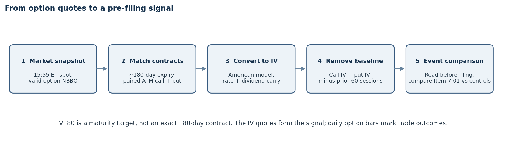
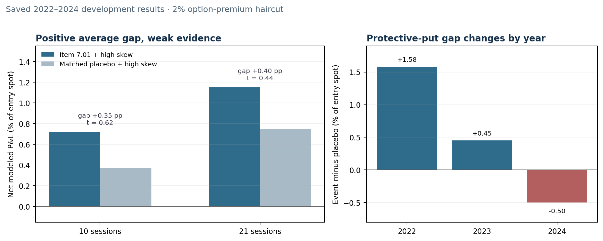

# When an 8-K meets unusual option skew

**Gator Quant Hacks 2026 · Systematic Trading · Massive**

## 1. Hypothesis

For a non-specialist: an 8-K tells investors that a company has publicly disclosed something. We ask whether option prices just before that disclosure contain a useful clue, and whether the filing helps separate those moments from ordinary days. The filing is context, not a forecast of whether the share price will rise or fall.

The strategy tests whether a company’s call-versus-put implied-volatility skew is unusually high before an SEC Item 7.01 filing. Item 7.01 is the Regulation FD section of Form 8-K. Companies may use it to make information broadly public after a selective communication; the category covers varied subjects, including business updates, so it does not carry a fixed bullish or bearish meaning. [Investor.gov explains Item 7.01](https://www.investor.gov/introduction-investing/general-resources/news-alerts/alerts-bulletins/investor-bulletins/how-read-8).

**Portfolio-manager hypothesis.** A pre-filing relative-skew residual may capture option-market repricing around information that is about to become broadly public. Conditioning on an actual disclosure could separate those episodes from ordinary option noise; a matched same-company placebo tests whether the filing adds information beyond the skew signal alone. The null is that the net event-minus-placebo return is zero after costs. This is a price-based proxy, not observed trader positioning. Historical open interest is unavailable in this input set, so the tested signal does not substitute volume for OI.

## 2. Method and trade

**How IV180 is built.** Each company-session uses the last completed five-minute stock bar at 15:55 ET for spot. The pipeline selects a standard listed expiry nearest 180 calendar days (within 150–210 days), then the strike nearest spot that has both a call and a put. It takes a valid bid/ask midpoint for each option from a quote no more than 60 seconds old, observed during the preceding five minutes. A QuantLib American-option model solves for implied volatility using the prior Treasury yield and trailing paid cash dividends as carry. “180-day IV” is therefore a maturity target, not a promise that every contract expires on exactly day 180.

Implied volatility is the volatility input that makes a pricing model match an observed option price. It reflects the option market’s priced uncertainty; it is not a direct record of positions or a guarantee of future volatility. For company $i$ and date $t$, define call-minus-put skew as $k_{i,t}=\sigma^{C}_{i,t}-\sigma^{P}_{i,t}$. The signal subtracts the company’s trailing 60-session average, using only earlier sessions, then standardizes that residual across companies on the same day. High-skew observations use $z>0.43$; this is a nominal upper-third cutoff under a normal reference, not a guaranteed empirical tercile.

The filing date maps to the first trading session strictly after the filing date, avoiding assumptions about intraday filing time or same-day execution. The primary trade is 100 shares plus one 3–6 month put about 5% below spot, entered at the event session and held for 10 sessions. The put limits downside while the stock retains upside exposure. The notebook compares the five standard structures—long call, covered call, protective put, collar, and cash-secured put—with four bonus structures: risk reversal, bull call spread, short strangle, and short straddle. Daily option bars, not the IV quote snapshots, supply entry and exit marks.

## 3. Results

The in-sample filing and signal dates run from March 7, 2022 through December 31, 2024. In preliminary saved development outputs, high-skew Item 7.01 protective-put trades average 0.72% of entry spot at 10 sessions and 1.15% at 21 sessions. Matched high-skew placebo trades average 0.37% and 0.75%; the event-minus-placebo gaps are 0.35 and 0.40 percentage points, with t-statistics 0.62 and 0.44. The positive differences are too uncertain to establish a reliable 8-K improvement. These saved values predate the newly added requested-end-date guard and must be refreshed before final performance claims.

| Portfolio statistic | Saved in-sample value |
|---|---:|
| Annualized Sharpe, 33 monthly cohorts | 0.45 |
| Summed cohort P&L | +11.6% |
| Maximum drawdown | 6.54% |
| Positive cohorts | 42% |

The risk reversal beats some weaker standard structures in the saved comparison but does not beat the protective put. The protective-put event-minus-placebo gap also changes sign across the three development years, so a positive pooled mean does not establish persistence. No organizer evaluation results are included here; the sealed evaluation is reserved.

At 21 sessions, the risk reversal averages 0.81% of entry spot versus 0.69% for covered calls, 0.49% for long calls, 0.17% for cash-secured puts, and 0.14% for collars. The protective put remains highest at 1.15%. Trade-level P&L is scaled by entry spot; the Sharpe above is calculated separately from monthly cohort returns.

## 4. Risks and failure conditions

The 33-cohort sample is small, and the signal uses a static large-cap universe rather than point-in-time membership, which can introduce survivorship bias. Daily option bars are imperfect execution proxies; the 2% premium haircut per option leg per side and 3 basis points per stock side may not capture every spread, exercise, or market-impact cost. The 5% put can lose premium during quiet markets. Results vary by year and do not meet the competition’s requested Sharpe objective. Treat the study as exploratory, not a demonstrated persistent edge.

## 5. Trade specification and reproduction

Use the high-skew Item 7.01 bucket, enter on the first session after the filing date, buy 100 shares and one 3–6 month put approximately 5% below spot, and exit after 10 sessions. Costs are 2% of option premium per leg per side and 3 basis points per stock side. The default filing/signal window is March 7, 2022–December 31, 2024. Run `strategy.ipynb` from a clean Python kernel after installing `requirements.txt` and setting `MASSIVE_API_KEY`. It shows event and placebo construction, IV180 construction, the five standard structures, bonus comparisons, cost/OTM/horizon results, and portfolio summaries. The organizer also requests expiry, entry-timing, and filing-category sensitivity; those additional comparisons remain pending and are marked in `SUBMISSION_CHECKLIST.md`.
